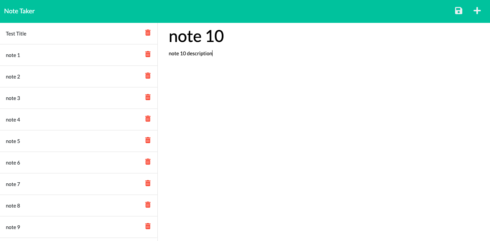

# Note Taker

## Description 

When initiated, this app presents the user with a clean, simple note taking tool.

  
## Table of Contents 
* [Installation](#installation)
* [Instructions](#instructions)
* [Languages & Tools](#languages-tools)
* [Credits](#credits)
* [Questions](#questions)

  
## Installation

Users will need node.js, fs, inquirer, and express.
  
## Instructions 

Clone repository and use npm install command in terminal. Then initiate app by typing node server.js in the terminal. Navigate to localhost:3001 in browser to use app.
1. Click "Get Started" button
2. Enter title in "Note Title"
3. Enter description in "Note Text"
4. Click floppy disk save icon to log note

[App Demo Video](https://watch.screencastify.com/v/k4D8C9sYQhUtMQRhkq3R)

## Languages & Tools

* JavaScript
* Node.js
* FS
* Inquirer
* Express
* Heroku

## Credits

1. Lauren Groh 
2. Front-end starter code from Trilogy and additional help from Trilogy tutor Ismael Lopez, Trilogy materials, and the below resources.
 * [Jonny Kalambay](https://youtu.be/MxfxiR8TVNU)
 * [Anson the Developer](https://youtu.be/1cjdlfB11Ss)
 * [Dev](https://dev.to/gathoni/express-req-params-req-query-and-req-body-4lpc)
 * [Stack Overflow](https://stackoverflow.com/questions/17604866/difference-between-readfile-and-readfilesync)
 * [Vuka](https://youtu.be/27GoRa4d15c)

## Questions

If you have any questions please connect with me through [GitHub](https://github.com/GrohTech) or [legroh@uwm.edu](mailto:legroh@uwm.edu).